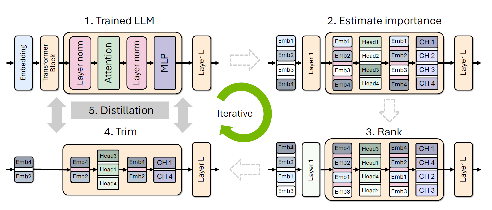

# Optimizing Large Language Models for Edge Deployment

## Overview

We have explored various optimization techniques to enable efficient inference of Large Language Models (LLMs) on edge devices. We have explored techniques such as pruning, knowledge distillation, quantization, and model parallelism to enhance computational efficiency while maintaining model performance. For demonstration, we've trained a custom GPT model on Shakespearean text and optimized it using pruning and distillation. Moreover, we have experimented with quantization for edge deployment using DistilGPT-2.

## Work Done So Far

- Implemented Genetic Algorithm to optimize ANNs and CNNs (for a classification task)
- Hyperparameter tuning of CNN using Genetic Algorithm
- L1 pruning of lightweight models like TinyBERT and ALBERT
- Explored various LLM compression techniques like pruning and knowledge distillation
- Explored different types of parallelism like data parallelism, tensor parallelism and pipeline model parallelism
- Built a small-scale GPT from scratch to understand the transformer architecture and the concept of self-attention
- Implemented a iterative pruning and distillation approach for the GPT we built

## Implementation Details

### Dataset Preparation and Model Training

We build a small-scale GPT model and train it on Shakespearean text. The dataset is preprocessed and tokenized using a character-based tokenizer to prepare it for model training.

### Model Optimization

1. **Pruning and Knowledge Distillation:**

- Iterative structured pruning and knowledge distillation techniques are applied to reduce model size while preserving performance.
- Importance scores for neurons, attentions heads and embeddings are calculated and these components are pruned based on the importance scores
- Knowledge training is used to retrain the model

  

2. **Parallelization:**

- Model parallelism is used for efficient fine-tuning on multi-GPU setups.

3. **Quantization:**

- 4-bit quantization (q4_k_m quantization) is applied and the model is converted to GGUF format for efficient inference on edge devices (using BitsAndBytes and llama.cpp libraries).

## Execution Steps

1. Train the custom GPT model on the Shakespeare dataset.
2. Apply pruning and distillation to reduce model size.
3. Quantize the model using low-bit precision methods.
4. Convert the model to GGUF format for better memory efficiency and better loading and inference speed.
5. Deploy the quantized model on edge for inference on CPU.

## Results and Observations

- Pruning and knowledge distillation significantly reduced model size (35.96%) while maintaining accuracy.
- 4-bit quantization enabled real-time inference on edge devices.
- Parallelism improved fine-tuning efficiency on multi-GPU setups.

## Future Work

- See: [link](https://github.com/friendshipkim/Compact-Language-Models-via-Pruning-and-Knowledge-Distillation) for implementation of the iterative pruning and distillation technique for Llama.
- Explore repos like [SmolChat](https://github.com/shubham0204/SmolChat-Android) and [ChatterUI](https://github.com/Vali-98/ChatterUI) which run LLMs on android phones => **both use llama.cpp internally to run GGUF files on-device**
- Implementing one-shot pruning techniques to further improve efficiency.
- Exploring adaptive quantization methods.
- Extending optimization techniques to larger LLMs like LLaMA-7B.
- Investigating fine-tuning (SFT, PEFT) of LLMs in a [federated](https://developer.nvidia.com/blog/turning-machine-learning-to-federated-learning-in-minutes-with-nvidia-flare-2-4/) setting.
- Exploring [Swarm Learning](https://www.nature.com/articles/s41586-021-03583-3) for distributed model fine-tuning.
